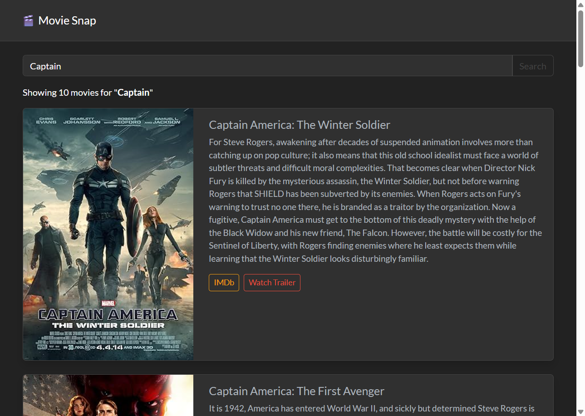

# 🎬 Movie Snap

Movie Snap is a responsive React web app that allows users to search for movies using the [OMDb API](http://www.omdbapi.com/). It displays movie information, including full details, with error handling and loading states.


##  Features

* 🔍 Search movies by title
* 🎞 View full movie details
* ⚠ Error handling (API errors, no results, network issues)
* 🔄 Loading spinner while fetching data
* 📱 Responsive UI using Bootstrap

##  Live Demo
https://movie-snap-ten.vercel.app/

## Preview




##  Tech Stack

* [React](https://reactjs.org/)
* [React Router](https://reactrouter.com/)
* [Bootstrap](https://getbootstrap.com/)
* [Tailwindcss](https://tailwindcss.com/)
* OMDb API


##  Getting Started

### 1. Clone the repository

```bash
git clone https://github.com/Arpit-mandhan-001/movie-snap.git
cd movie-snap
```

### 2. Install dependencies

```bash
npm install
# or
yarn install
```

### 3. Setup OMDb API key

Create a `.env` file in the root of the project:

```
REACT_APP_OMDB_API_KEY=your_api_key_here
```

You can get a free OMDb API key here: [http://www.omdbapi.com/apikey.aspx](http://www.omdbapi.com/apikey.aspx)

### 4. Run the app

```bash
npm start
# or
yarn start
```

The app will open in your default browser at [http://localhost:3000](http://localhost:3000)

---

##  Production Build

To build the app for production:

```bash
npm run build
# or
yarn build
```

---

## 🔐 Notes on API Key Security

Since this is a frontend app, your API key **cannot be completely hidden**. To keep it private:

* Use a backend server or serverless function to proxy requests
* Restrict your API key by domain or usage quota in your OMDb account

---


##  Acknowledgments

* [OMDb API](http://www.omdbapi.com/) for movie data
* [Bootstrap]() and [tailwind](https://getbootstrap.com/) for UI components

---

## 🧑‍💻 Author

**Arpit Mandhan**
[GitHub](https://github.com/Arpit-mandhan-001) | [LinkedIn](https://www.linkedin.com/in/arpit-mandhan-21374b367/)

